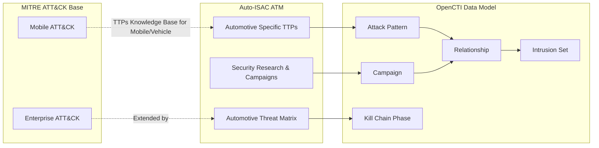

# OpenCTI AI Incident Database (AIID) Connector

| Status | Date | Comment |
|--------|------|---------|
| -  | -    | -       |

This connector named AIID CONNECTOR imports the complete AI incident database into OpenCTI.

## Table of Contents

- [OpenCTI AIID Connector](#opencti_connector_atm)
  - [Table of Contents](#table-of-contents)
  - [Introduction](#introduction)
  - [Installation](#installation)
    - [Requirements](#requirements)
  - [Configuration variables](#configuration-variables)
    - [OpenCTI environment variables](#opencti-environment-variables)
    - [Base connector environment variables](#base-connector-environment-variables)
    - [Connector extra parameters environment variables](#connector-extra-parameters-environment-variables)
  - [Deployment](#deployment)
    - [Docker Deployment](#docker-deployment)
    - [Manual Deployment](#manual-deployment)
  - [Usage](#usage)
  - [Behavior](#behavior)
  - [Debugging](#debugging)
  - [Additional information](#additional-information)

## Introduction

Where the aviation industry has clear definitions, computer scientists and philosophers have long debated foundational definitions of artificial intelligence. In the absence of clear lines differentiating algorithms, intelligence, and the harms they may directly or indirectly cause, the AI Incident Database ([AIID](https://incidentdatabase.ai/)) database adopts an adaptive criteria for ingesting "incidents" where reports are accepted or rejected on the basis of a growing rule set defined in the Editor's Guide.

This connector imports the complete AIID.

All data is imported in native STIX 2.1 format from ATM's official site.

## Installation

### Requirements

- OpenCTI Platform >= 6.x
- Internet access to GitHub raw content

## Configuration variables

There are a number of configuration options, which are set either in `docker-compose.yml` (for Docker) or in `config.yml` (for manual deployment).

### OpenCTI environment variables

| Parameter     | config.yml | Docker environment variable | Mandatory | Description                                          |
|---------------|------------|-----------------------------|-----------|------------------------------------------------------|
| OpenCTI URL   | url        | `OPENCTI_URL`               | Yes       | The URL of the OpenCTI platform.                     |
| OpenCTI Token | token      | `OPENCTI_TOKEN`             | Yes       | The default admin token set in the OpenCTI platform. |

### Base connector environment variables

| Parameter         | config.yml      | Docker environment variable   | Default         | Mandatory | Description                                                                 |
|-------------------|-----------------|-------------------------------|-----------------|-----------|-----------------------------------------------------------------------------|
| Connector ID      | id              | `CONNECTOR_ID`                |                 | Yes       | A unique `UUIDv4` identifier for this connector instance.                   |
| Connector Type      | type              | `CONNECTOR_TYPE`                |  "EXTERNAL_IMPORT"               | Yes       | The type of the connector (in this case "EXTERNAL_IMPORT")                   |
| Connector Name    | name            | `CONNECTOR_NAME`              | AI Incident Database    | Yes        | Name of the connector.                                                      |
| Connector Scope   | scope           | `CONNECTOR_SCOPE`             | "identity", "report"           | Yes        | The scope or type of data the connector is importing.                       |
| Log Level         | log_level       | `CONNECTOR_LOG_LEVEL`         | info           | Yes        | Determines the verbosity of the logs: `debug`, `info`, `warn`, or `error`.  |

### Connector extra parameters environment variables

| Parameter                | config.yml                   | Docker environment variable      | Default                                                                              | Mandatory | Description                                                    |
|--------------------------|------------------------------|----------------------------------|--------------------------------------------------------------------------------------|-----------|----------------------------------------------------------------|
| AIID GraphQL URL | aiid.graphql_url | `AIID_GRAPHQL_URL` | "https://incidentdatabase.ai/api/graphql"                                                                              | Yes        | The URL for the Knowledge Base.            |
| AIID BATCH SIZE | aiid.batch_size | `AIID_BATCH_SIZE` | 50                  | Yes        | The betch size used to import the Knowledge Base.            |
| AIID Confidence Level | aiid.confidence_level | `AIID_CONFIDENCE_LEVEL` | 75                                                                              | Yes        | The confidence level for the information ingested.            |
| AIID Batch Delay | aiid.batch_delay | `AIID_BATCH_DELAY` | 1                                                                              | Yes        | The delay (i.e. timeout) between two queries.  
| AIID Author Name | aiid.author_name | `AIID_AUTHOR_NAME` | AI Incident Database      | Yes        | The author's name for each entity ingested.            |
| AIID Author Identity Class | aiid.author_identity_class | `AIID_AUTHOR_IDENTITY_CLASS` | "organization"                                                                              | Yes        | The author's identity class the author.      |

## Deployment

### Docker Deployment

Build the Docker image:

```bash
docker build -t opencti/connector-aiid:latest .
```

Configure the connector in `docker-compose.yml`:

```yaml
  connector-aiid:
    image: ghcr.io/serlabuniba/opencti_connector_aiid:latest
    build:
      context: ./connector-aiid
    environment:
      - OPENCTI_URL=http://localhost
      - OPENCTI_TOKEN=ChangeMe
      - CONNECTOR_ID=ChangeMe
      - CONNECTOR_TYPE=EXTERNAL_IMPORT
      - CONNECTOR_NAME=AI Incident Database
      - CONNECTOR_SCOPE=identity,report
      - CONNECTOR_LOG_LEVEL=info
      - CONNECTOR_DURATION_PERIOD=P1D
      - CONNECTOR_RESET_STATE_ON_START=false
      - AIID_GRAPHQL_URL=https://incidentdatabase.ai/api/graphql
      - AIID_BATCH_SIZE=50
      - AIID_BATCH_DELAY=1
      - AIID_CONFIDENCE_LEVEL=75
      - AIID_AUTHOR_NAME=AI Incident Database
      - AIID_AUTHOR_IDENTITY_CLASS=organization
    depends_on:
      opencti:
          condition: service_healthy
    restart: always
```

Start the connector:

```bash
docker compose up -d
```

### Manual Deployment

1. Create `config.yml` based on `config.yml.sample`.

2. Install dependencies:

```bash
pip3 install -r requirements.txt
```

3. Start the connector from the `src` directory:

```bash
python3 -m __main__
```

## Usage

The connector runs automatically at the interval defined by `CONNECTOR_DURATION_PERIOD` (7 days).

To force an immediate run:

**Data Management → Ingestion → Connectors**

Find the connector and click the refresh button to reset the state and trigger a new sync.

## Behavior

The connector fetches all the AI incidents and reports from the [AIID](https://incidentdatabase.ai/) official site and imports them directly into OpenCTI. During the processing of the entire database, all the information are coded into a STIX 2.1 bundle. For each incident, the connector:
1. Create author Identity (AI Incident Database),
2. Create Incident entity linking to author,
3. Extract Deployers and link them to the Incident
4. For each report related to the incident:
-- If report already exists in OpenCTI → link incident to report
-- If report does not exist → create report and link to incident

The query for the AIID is:
INCIDENTS_QUERY = """
query($pagination: PaginationType, $sort: IncidentSortType, $languages: [String]!) {
  incidents (pagination: $pagination, sort: $sort){
    incident_id
    title
    description
    editor_notes
    date
    date_modified
    created_at
    reports {
      url
      source_domain
      authors
      created_at
      date_published
      date_submitted
      description
      image_url
      language
      report_number
      submitters
      title
      text
      tags
      is_incident_report
      inputs_outputs
    }
    implicated_systems {
      name
      entity_id
    }
    AllegedDeployerOfAISystem {
      name
      entity_id
      created_at
      date_modified
    }
    AllegedDeveloperOfAISystem {
      name
      entity_id
      created_at
      date_modified
    }
    AllegedHarmedOrNearlyHarmedParties {
      name
      entity_id
      created_at
    }
    editor_dissimilar_incidents
    editor_similar_incidents
    editors {
      first_name
      last_name
      roles
      userId
    }
    nlp_similar_incidents {
      similarity
      incident_id
    }
    translations(languages: $languages) {
      language
      description
      title
      dirty
    }
    classifications {
      namespace
    }
  }
}
"""

### Data Flow



### Entity Mapping

| MITRE Data Type      | OpenCTI Entity      | Spaceshield Specific Content & Description       |
|----------------------|---------------------|--------------------------------------------------|
| attack-pattern       | Attack Pattern      | Tactics and techniques. It includes specific automotive-domain techniques (e.g. CAN Bus Injection, Key Fob Relay, Jailbreaking ECU).                           |
| campaign             | Campaign            | Attack campaigns. It includes case studies of real-world exploits or security research (e.g., “Jailbreaking an electric vehicle”).                               |
| course-of-action     | Course of Action    | Mitigations and defensive measures. It includes specific mitigations for the Ground and Space segments (e.g., on-board encryption).               |
| x-mitre-tactic       | Kill Chain Phases                   | Converted to kill chain phases. It includes specific phases of an automotive attack (e.g., Vehicle Function Affect, Safety-Critical Access).                   |
| x-mitre-matrix       | Kill Chain                   | ATT&CK matrix metadata. It generates the dedicated “Automotive Threat Matrix” view in the tactical panel.                           |                    |
| external-reference  | External Reference                   | Direct links to the official Mitre Attack and to case studies useful to demonstration videos, USENIX papers, Black Hat presentations, and NVD/CVE advisories...                      |
		
### ATT&CK Matrices Required

1. **Enterprise ATT&CK**: Windows, macOS, Linux, Cloud, Network, Containers
2. **CAPEC**: Attack patterns with CWE/CVE relationships

### ATT&CK Matrices Imoported
1. **ATM-Automotive**: Automotive-domain specific kill chain phases

### Processing Details

- **Native STIX Import**: All data is in native STIX 2.1 format
- **Relationships**: All MITRE relationships (uses, mitigates, subtechnique-of) are preserved. Specific relatioships for the “automotive” domain are added.
- **Kill Chain**: ATT&CK tactics are mapped to kill chain phases. Specific kill chain phases for the “automotive” domain are added.
- **External References**: MITRE IDs and documentation links are preserved. Specific external references are added for the "automotive" domain (by ISAC).

## Debugging

Enable verbose logging:

```env
CONNECTOR_LOG_LEVEL=debug
```

## Additional information

- **Large Dataset**: Initial import may take several minutes due to the size
- **Reference**: [MITRE ATT&CK](https://attack.mitre.org/) | [CAPEC](https://capec.mitre.org/) | [ATM](https://atm.automotiveisac.com/)
